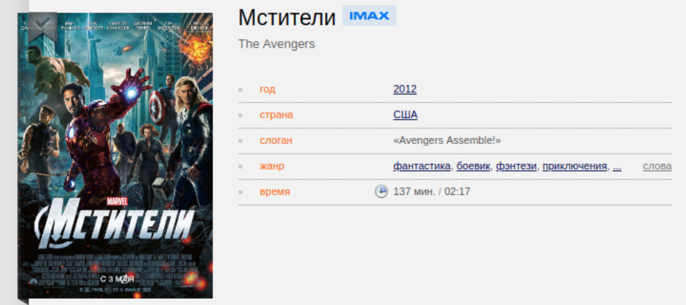

# Домашнее задание к лекции «TypeScript»

**Важно**: все задачи допустимо выполнять в одном GitHub репозитории.

**Важно**: тесты должны обеспечивать 100% покрытие тестируемых функций по строкам.

**Важно**: вы можете использовать преднастроенный [шаблон](../ts-template/).

В личном кабинете на сайте [netology.ru](http://netology.ru/) в поле комментария к домашней работе вставьте ссылки на ваш GitHub-проекты.

---

## Новые типы

### Описание

На лекции мы написали классы для книг и аудио-альбомов. Но этого недостаточно, т.к. владельцы портала решили добавить возможность поддержки продажи фильмов.

Реализуйте класс `Movie`, который позволяет отобразить информацию, указанную на скриншоте (скриншот с сайта КиноПоиск):

Удостоверьтесь, что добавление объектов вашего класса в корзину работает.

---
